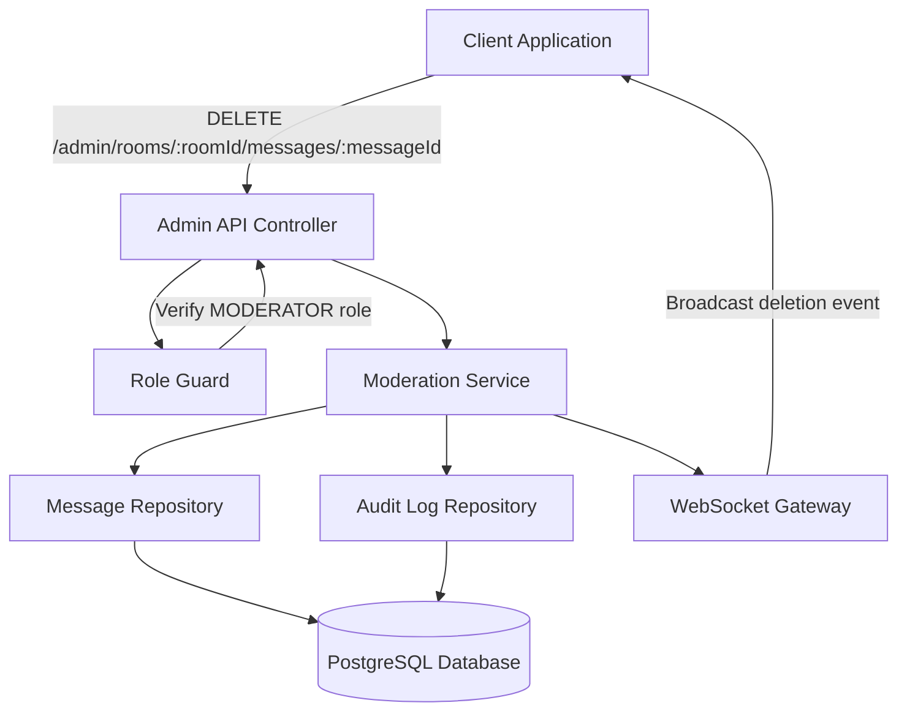

# Design Document: Message Moderation

## Overview

The message moderation feature enables authorized moderators to delete individual inappropriate messages within chat rooms through a dedicated admin API endpoint. The system implements soft deletion with content replacement, maintains comprehensive audit trails with SHA-256 content hashing, and broadcasts real-time updates to all room participants via WebSocket.

This feature extends the existing NestJS-based chat application, integrating with the current TypeORM message entities, Socket.io WebSocket infrastructure, and role-based access control system.

## Architecture

### High-Level Architecture



### Component Interaction Flow

1. Moderator sends DELETE request to admin endpoint with deletion reason
2. Role Guard verifies MODERATOR role or higher
3. Moderation Service validates request parameters
4. Service retrieves original message from database
5. Service computes SHA-256 hash of original content
6. Service creates audit log entry with hash and metadata
7. Service performs soft deletion (replaces content, sets deletion fields)
8. Service persists changes to database
9. Service triggers WebSocket broadcast to all room members
10. All connected clients receive deletion event and update UI

## Components and Interfaces

### 1. Admin Moderation Controller

**Responsibility**: Handle HTTP requests for message moderation operations

**Endpoint**:
```typescript
DELETE /admin/rooms/:roomId/messages/:messageId
```

**Request Parameters**:
- `roomId` (path): UUID of the room containing the message
- `messageId` (path): UUID of the message to delete

**Request Body**:
```typescript
{
  reason: string; // Required, 1-1000 characters
}
```

**Response** (200 OK):
```typescript
{
  success: true;
  message: {
    id: string;
    roomId: string;
    content: string; // "[removed by moderator]"
    deletedAt: string; // ISO 8601 timestamp
    deletedBy: string; // Moderator user ID
  };
  auditLogId: string;
}
```

**Error Responses**:
- `400 Bad Request`: Invalid roomId, messageId, or missing/invalid reason
- `403 Forbidden`: User lacks MODERATOR role
- `404 Not Found`: Message or room not found

**Guards**: `@UseGuards(JwtAuthGuard, RoleGuard)`
**Decorators**: `@Roles(RoleType.MODERATOR, RoleType.ADMIN)`

### 2. Moderation Service

**Responsibility**: Business logic for message moderation, audit logging, and coordination

**Key Methods**:

```typescript
class ModerationService {
  async deleteMessage(
    roomId: string,
    messageId: string,
    moderatorId: string,
    reason: string
  ): Promise<ModerationResult>;
  
  private async createAuditLog(
    message: Message,
    moderatorId: string,
    reason: string
  ): Promise<AuditLog>;
  
  private computeContentHash(content: string): string;
  
  private async broadcastDeletion(
    roomId: string,
    messageId: string,
    replacementContent: string
  ): Promise<void>;
}
```

**Dependencies**:
- `MessageRepository` (TypeORM)
- `AuditLogRepository` (TypeORM)
- `MessagesGateway` (WebSocket)
- Node.js `crypto` module for SHA-256 hashing

### 3. Audit Log Entity

**Responsibility**: Persist moderation actions for compliance and appeals

**Schema**:
```typescript
@Entity('moderation_audit_logs')
class ModerationAuditLog {
  @PrimaryGeneratedColumn('uuid')
  id: string;
  
  @Column('uuid')
  roomId: string;
  
  @Column('uuid')
  messageId: string;
  
  @Column('varchar', { length: 64 })
  contentHash: string; // SHA-256 hash (hex encoded)
  
  @Column('text')
  reason: string;
  
  @Column('uuid')
  moderatorId: string;
  
  @CreateDateColumn()
  createdAt: Date;
  
  @Index()
  @Column('uuid')
  @ManyToOne(() => Message)
  message: Message;
  
  @Index()
  @Column('uuid')
  @ManyToOne(() => User)
  moderator: User;
}
```

**Indexes**:
- `messageId` (for audit trail lookup)
- `moderatorId` (for moderator activity reports)
- `createdAt` (for time-based queries)

### 4. Message Entity Updates

**Existing Fields** (already present in `Message` entity):
- `deletedAt: Date | null`
- `deletedBy: string | null`
- `isDeleted: boolean`

**No schema changes required** - the existing soft deletion fields support this feature.

### 5. WebSocket Event Broadcasting

**Event Name**: `message-deleted`

**Event Payload**:
```typescript
{
  roomId: string;
  messageId: string;
  content: string; // "[removed by moderator]"
  deletedAt: string; // ISO 8601 timestamp
  deletedBy: string; // Moderator user ID
}
```

**Broadcasting Method**:
```typescript
messagesGateway.broadcastToRoom(roomId, 'message-deleted', payload);
```

## Data Models

### ModerationAuditLog

```typescript
interface ModerationAuditLog {
  id: string;
  roomId: string;
  messageId: string;
  contentHash: string; // SHA-256 hex string (64 characters)
  reason: string;
  moderatorId: string;
  createdAt: Date;
}
```

### DeleteMessageDto

```typescript
class DeleteMessageDto {
  @IsString()
  @IsNotEmpty()
  @MinLength(1)
  @MaxLength(1000)
  reason: string;
}
```

### ModerationResult

```typescript
interface ModerationResult {
  success: boolean;
  message: {
    id: string;
    roomId: string;
    content: string;
    deletedAt: Date;
    deletedBy: string;
  };
  auditLogId: string;
}
```

## Correctness Properties

*A property is a characteristic or behavior that should hold true across all valid executions of a system—essentially, a formal statement about what the system should do. Properties serve as the bridge between human-readable specifications and machine-verifiable correctness guarantees.*

### Property 1: Request validation rejects invalid inputs

*For any* deletion request with missing reason field, non-string reason, or invalid UUID format for roomId/messageId, the system should reject the request with a 400 Bad Request response and not modify any data.

**Validates: Requirements 1.2, 1.3**

### Property 2: Soft deletion state consistency

*For any* message that is successfully deleted by a moderator, the message entity should have content replaced with "[removed by moderator]", deletedAt set to a recent timestamp (within 5 seconds of request), deletedBy set to the moderator's user ID, and the message record should still exist in the database.

**Validates: Requirements 2.1, 2.2, 2.3, 2.4**

### Property 3: WebSocket event completeness

*For any* message deletion, all members of the room should receive a WebSocket event containing the messageId, roomId, replacement content "[removed by moderator]", deletedAt timestamp, and deletedBy moderator ID.

**Validates: Requirements 3.1, 3.2, 3.3**

### Property 4: Authorization enforcement

*For any* user without MODERATOR or ADMIN role, deletion requests should return 403 Forbidden and the target message should remain completely unchanged (content, deletedAt, deletedBy, isDeleted all unchanged).

**Validates: Requirements 4.1, 4.2, 4.3**

### Property 5: Audit log completeness

*For any* message deletion, an audit log entry should be created containing the roomId, messageId, SHA-256 content hash, deletion reason, moderator's user ID, and a timestamp within 5 seconds of the deletion.

**Validates: Requirements 5.1, 5.2, 5.3, 5.4, 5.5, 5.6, 5.7**

### Property 6: SHA-256 hash correctness

*For any* message content, the computed hash should be a valid 64-character hexadecimal string, and hashing the same content twice should produce identical hashes.

**Validates: Requirements 6.1**

### Property 7: Audit log privacy

*For any* audit log entry, the entry should contain only the SHA-256 hash of the original content and should not contain the original message content in any field.

**Validates: Requirements 6.2**

## Error Handling

### Validation Errors

**Invalid Request Parameters**:
- Missing or empty `reason` field → 400 Bad Request
- `reason` exceeds 1000 characters → 400 Bad Request
- Invalid UUID format for `roomId` or `messageId` → 400 Bad Request

**Resource Not Found**:
- Message does not exist → 404 Not Found
- Room does not exist → 404 Not Found
- Message does not belong to specified room → 400 Bad Request

### Authorization Errors

**Insufficient Permissions**:
- User lacks MODERATOR role → 403 Forbidden
- JWT token missing or invalid → 401 Unauthorized

### System Errors

**Database Errors**:
- Connection failures → 503 Service Unavailable
- Transaction rollback on audit log creation failure
- Retry logic for transient failures (max 3 attempts)

**WebSocket Errors**:
- Broadcast failures should be logged but not block the deletion
- Failed broadcasts should trigger retry mechanism
- Clients should handle reconnection and state synchronization

### Error Response Format

```typescript
{
  statusCode: number;
  message: string;
  error: string;
  timestamp: string;
  path: string;
}
```

## Testing Strategy

### Unit Testing

**Framework**: Jest with `@nestjs/testing`

**Test Suites**:

1. **ModerationService Tests**:
   - Soft deletion logic (content replacement, field updates)
   - SHA-256 hash computation (correctness, determinism)
   - Audit log creation (all required fields present)
   - Error handling (message not found, invalid parameters)
   - Transaction rollback scenarios

2. **Admin Controller Tests**:
   - Request validation (DTO validation)
   - Parameter extraction (roomId, messageId from path)
   - Response formatting
   - Error response structure

3. **Role Guard Tests**:
   - MODERATOR role verification
   - ADMIN role verification (higher privilege)
   - USER role rejection
   - Missing role rejection

**Mocking Strategy**:
- Mock TypeORM repositories
- Mock WebSocket gateway
- Mock JWT authentication

### Property-Based Testing

**Framework**: fast-check (JavaScript property-based testing library)

**Configuration**: Minimum 100 iterations per property test

**Property Tests** (each tagged with feature and property number):

1. **Property 1 Test**: Generate random invalid inputs (empty strings, non-UUIDs, missing fields) and verify all are rejected
   - Tag: `Feature: message-moderation, Property 1: Request validation rejects invalid inputs`

2. **Property 2 Test**: Generate random messages and moderators, perform deletion, verify soft deletion state
   - Tag: `Feature: message-moderation, Property 2: Soft deletion state consistency`

3. **Property 3 Test**: Generate random deletions, verify WebSocket event payload contains all required fields
   - Tag: `Feature: message-moderation, Property 3: WebSocket event completeness`

4. **Property 4 Test**: Generate random users without MODERATOR role, verify all deletion attempts fail without modification
   - Tag: `Feature: message-moderation, Property 4: Authorization enforcement`

5. **Property 5 Test**: Generate random deletions, verify audit log contains all required fields
   - Tag: `Feature: message-moderation, Property 5: Audit log completeness`

6. **Property 6 Test**: Generate random message content, verify hash format and determinism
   - Tag: `Feature: message-moderation, Property 6: SHA-256 hash correctness`

7. **Property 7 Test**: Generate random deletions, verify audit log never contains original content
   - Tag: `Feature: message-moderation, Property 7: Audit log privacy`

### End-to-End Testing

**Framework**: Supertest with Jest

**Test Scenarios**:

1. **Complete Deletion Workflow**:
   - Create room and message
   - Authenticate as moderator
   - Send DELETE request
   - Verify response structure
   - Query message to confirm soft deletion
   - Query audit log to confirm entry created
   - Verify WebSocket event received by connected clients

2. **Authorization Flow**:
   - Authenticate as regular user (no MODERATOR role)
   - Attempt deletion
   - Verify 403 Forbidden response
   - Verify message unchanged

3. **WebSocket Broadcasting**:
   - Connect multiple clients to room
   - Perform deletion as moderator
   - Verify all clients receive `message-deleted` event
   - Verify event payload structure

4. **Error Scenarios**:
   - Invalid message ID → 404
   - Invalid room ID → 404
   - Missing reason → 400
   - Message from different room → 400

**Test Database**: Use separate test database with migrations applied

**Cleanup**: Reset database state between tests using transactions or database truncation

### Integration Testing

**WebSocket Integration**:
- Test WebSocket gateway integration with moderation service
- Verify room-based broadcasting
- Test client connection/disconnection handling

**Database Integration**:
- Test TypeORM repository operations
- Verify transaction handling
- Test concurrent deletion attempts

**Authentication Integration**:
- Test JWT token validation
- Test role extraction from token
- Test guard integration with controller

### Test Coverage Goals

- Unit test coverage: >80% for service and controller logic
- Property-based tests: All 7 correctness properties implemented
- E2E tests: All critical user flows covered
- Integration tests: All external dependencies tested

### Continuous Integration

- Run unit tests on every commit
- Run property-based tests on every pull request
- Run E2E tests before deployment
- Generate coverage reports and enforce minimum thresholds
